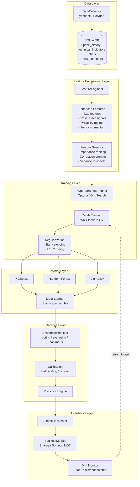
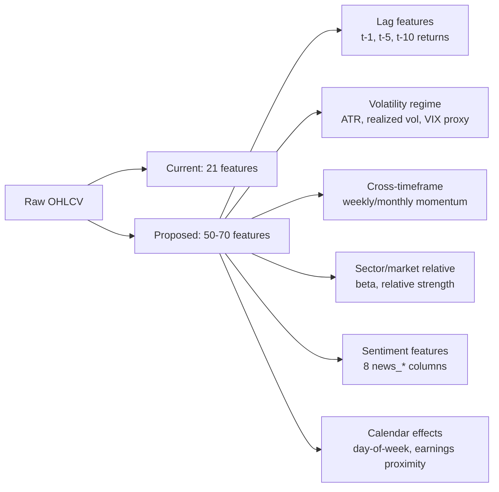
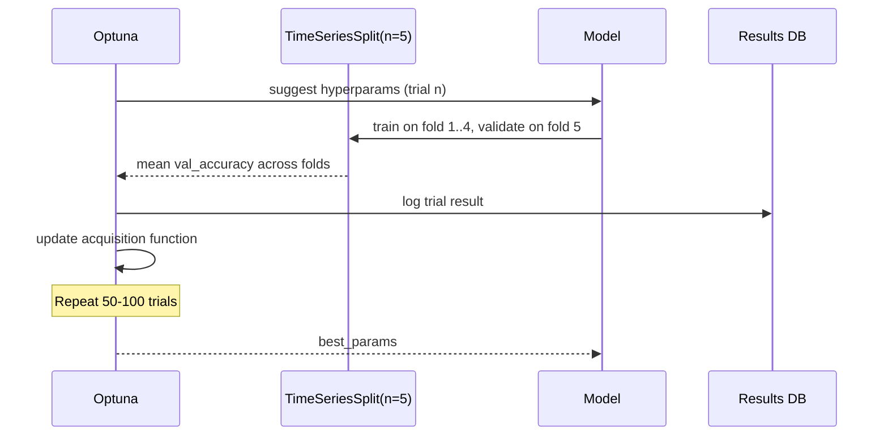
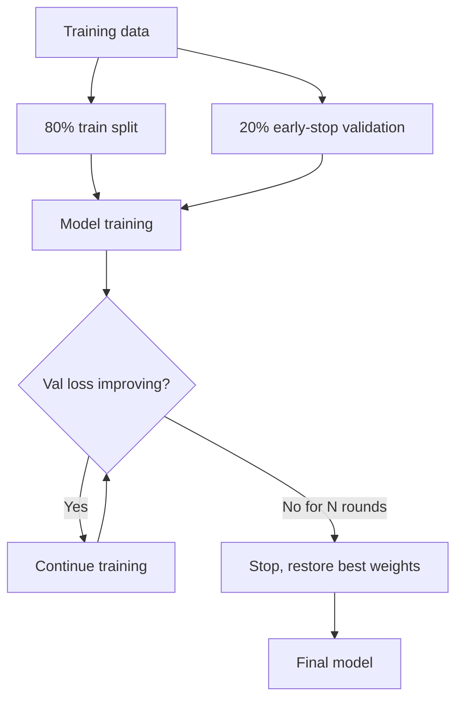
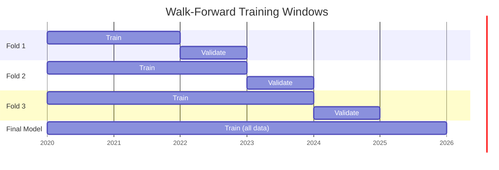
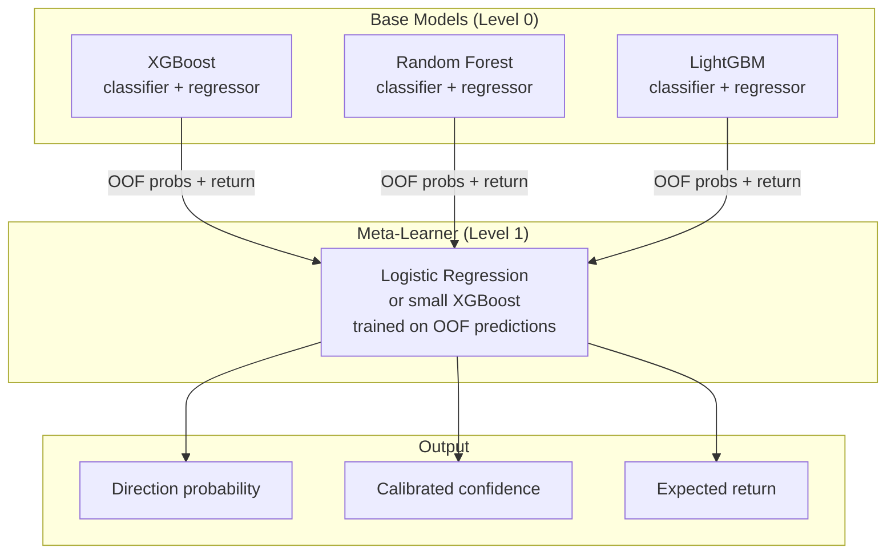
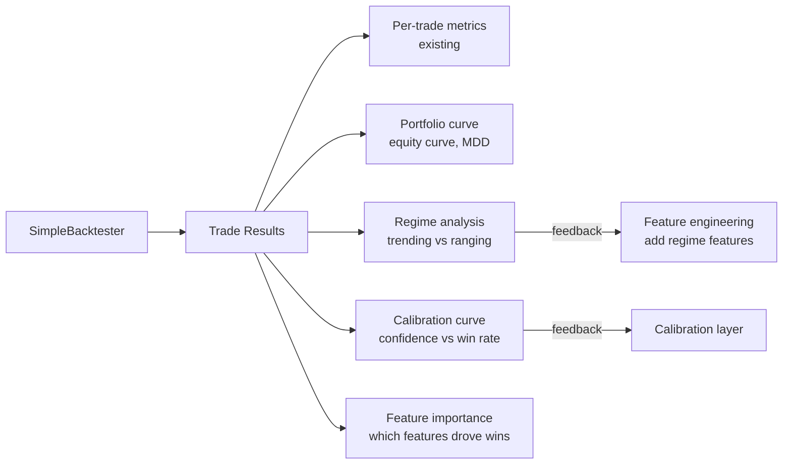
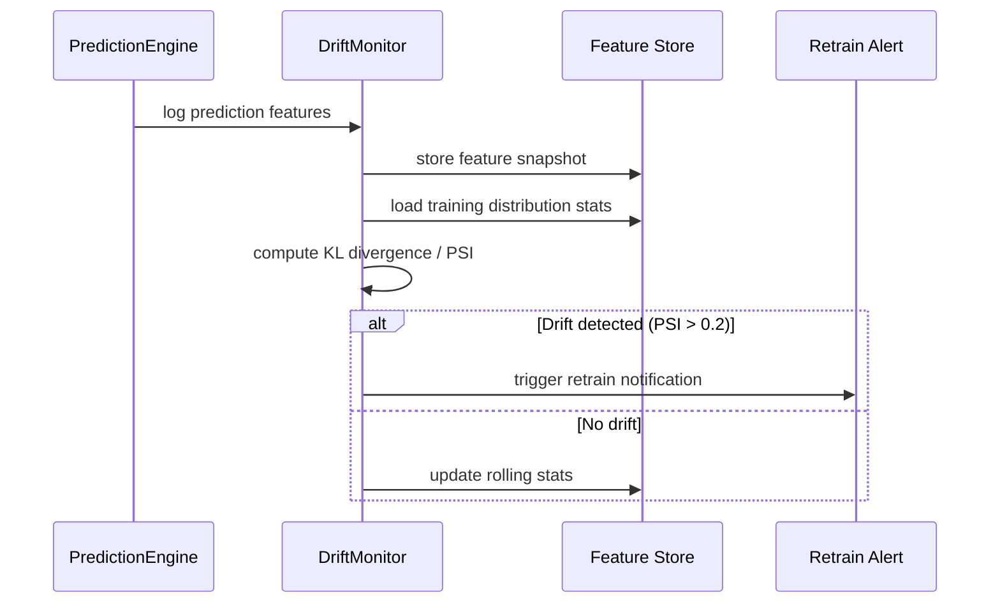

# Design Document: ML Model Improvements

## Overview

The current ML pipeline trains three ensemble models (XGBoost, Random Forest, LightGBM) to predict 5-day stock price direction and return magnitude. While the infrastructure is solid, the training metadata reveals significant issues: all three regressors have negative R² on validation data (meaning they perform worse than a mean baseline), and classifiers sit at ~52–53% accuracy — barely above random. This design explores targeted improvements across the full pipeline: feature engineering, model architecture, training methodology, ensemble strategy, and backtesting feedback loops.

The goal is to move from a pipeline that technically runs to one that produces genuinely predictive signals, with measurable improvements in validation accuracy, regressor R², and backtested Sharpe ratio.

---

## Current State Assessment

### Observed Weaknesses (from `training_metadata.json`)

| Model | Val Accuracy | Val R² (regressor) | Notes |
|---|---|---|---|
| XGBoost | 52.6% | -0.10 | Severe overfitting (train acc 72.5%) |
| Random Forest | 53.2% | -0.016 | Near-random recall bias (98.8% recall) |
| LightGBM | 53.0% | -0.12 | Similar overfitting pattern |

Key problems:
- All regressors have **negative validation R²** — they are worse than predicting the mean
- Large train/val accuracy gap on XGBoost and LightGBM → overfitting
- Random Forest has 98.8% recall but only 53.3% precision → predicting "up" for almost everything
- No hyperparameter tuning — all models use hardcoded defaults
- Features are raw OHLCV + basic indicators with no normalization or selection
- Single 80/20 time split for final training (no walk-forward for final models)
- No feature importance analysis or selection
- Sentiment features exist in the schema but are absent from the 21 training features (no `news_*` columns in metadata)

---

## Architecture



---

## Improvement Areas

### 1. Feature Engineering Improvements



**Current features (21):** Raw OHLCV, RSI, MACD, SMAs, EMAs, Bollinger Bands, volume SMA, 3 derived ratios.

**Proposed additions:**

| Feature Group | Features | Rationale |
|---|---|---|
| Lag returns | `return_1d`, `return_5d`, `return_10d`, `return_20d` | Momentum and mean-reversion signals |
| Volatility | `atr_14`, `realized_vol_20d`, `vol_regime` (high/low) | Regime-aware predictions |
| Relative strength | `rs_vs_spy_20d`, `rs_vs_sector_20d` | Market-relative momentum |
| Sentiment | `news_sentiment_score`, `news_macro_sentiment`, etc. (8 features) | Already in DB, not used in training |
| Calendar | `day_of_week`, `days_to_earnings`, `month` | Seasonality and event effects |
| Bollinger position | `bb_pct_b`, `bb_width` | Normalized band position |
| Volume profile | `obv_slope_5d`, `vwap_deviation` | Smart money flow |

**Feature selection pipeline:**
1. Remove features with >5% missing values
2. Remove near-zero variance features
3. Remove features with >0.95 pairwise correlation
4. Rank by XGBoost feature importance
5. Keep top 40 features for final training

---

### 2. Model Architecture Improvements

#### 2a. Hyperparameter Tuning

Current models use hardcoded defaults. Proposed: Optuna-based Bayesian optimization with time-series cross-validation.



**Search spaces:**

| Model | Key Parameters | Range |
|---|---|---|
| XGBoost | `n_estimators`, `max_depth`, `learning_rate`, `min_child_weight`, `gamma`, `reg_alpha`, `reg_lambda` | n_est: 100-500, depth: 3-8, lr: 0.01-0.3 |
| LightGBM | `num_leaves`, `min_data_in_leaf`, `feature_fraction`, `bagging_fraction`, `lambda_l1`, `lambda_l2` | leaves: 20-150, min_data: 10-100 |
| Random Forest | `n_estimators`, `max_depth`, `min_samples_split`, `max_features` | n_est: 100-500, depth: 5-20 |

#### 2b. Regularization & Early Stopping

XGBoost and LightGBM support early stopping — currently unused. Adding this will directly address the overfitting gap (72.5% train vs 52.6% val for XGBoost).



#### 2c. Probability Calibration

Current classifiers output raw probabilities that may not be well-calibrated (a 70% confidence prediction may not win 70% of the time). Adding Platt scaling or isotonic regression calibration will make confidence scores more meaningful for the ensemble and backtester.

---

### 3. Training Methodology Improvements

#### 3a. Walk-Forward for Final Models

Currently, final models use a single 80/20 split. Walk-forward validation is used for evaluation but not for training the saved models. Proposed: train final models using expanding window walk-forward, then retrain on all data.



#### 3b. Class Imbalance Handling

The Random Forest's 98.8% recall / 53.3% precision pattern indicates it's predicting "up" for nearly everything. This suggests class imbalance in the training data (more up days than down days in a bull market). Proposed fixes:

- `class_weight='balanced'` for Random Forest
- `scale_pos_weight` for XGBoost
- `is_unbalance=True` for LightGBM
- Optional: SMOTE oversampling for minority class

#### 3c. Target Engineering

Current target: binary direction (up/down) based on raw 5-day return. Proposed improvements:

| Target | Description | Benefit |
|---|---|---|
| Threshold-based direction | Up only if return > +1%, Down only if < -1%, else skip | Removes noise from near-zero moves |
| Tertile classification | Top 33% / Middle 33% / Bottom 33% | Richer signal, avoids ambiguous middle |
| Risk-adjusted return | Forward return / realized volatility | Normalizes for regime |

---

### 4. Ensemble Strategy Improvements

#### Current Ensemble

Three strategies exist (voting, averaging, unanimous) but they treat all models equally and use hardcoded confidence boosts (+10% for voting consensus, +15% for unanimous).

#### Proposed: Stacking Meta-Learner



The meta-learner is trained on out-of-fold (OOF) predictions from base models, preventing data leakage. It learns which base model to trust under which market conditions.

#### Dynamic Weighting

Alternative to stacking: weight each model by its recent rolling accuracy (last 30 days of backtested predictions), so models that are performing well in the current regime get more weight.

---

### 5. Backtesting Feedback Loop

#### Current Backtester Limitations

- No Sharpe/Sortino ratio at portfolio level (only per-trade)
- No maximum drawdown tracking over time
- No regime analysis (does the model work better in trending vs ranging markets?)
- No comparison against sector benchmarks
- Confidence calibration not validated against actual win rates

#### Proposed Enhancements



**New metrics to add:**

| Metric | Formula | Target |
|---|---|---|
| Annualized Sharpe | `(mean_return / std_return) * sqrt(252)` | > 1.0 |
| Sortino ratio | Uses downside deviation only | > 1.5 |
| Max drawdown | Peak-to-trough equity curve | < 20% |
| Calmar ratio | Annual return / max drawdown | > 0.5 |
| Confidence calibration | Actual win rate at each confidence decile | Monotonically increasing |

---

### 6. Data Quality & Drift Monitoring

#### Feature Distribution Monitoring

Models trained on historical data can degrade when market regimes shift. Proposed: track feature distributions over time and alert when drift is detected.



**Population Stability Index (PSI)** thresholds:
- PSI < 0.1: No significant change
- 0.1 ≤ PSI < 0.2: Minor shift, monitor
- PSI ≥ 0.2: Major shift, retrain recommended

---

## Components and Interfaces

### Enhanced FeatureEngineer

**New methods:**

```python
class FeatureEngineer:
    def add_lag_features(self, df: pd.DataFrame, periods: list[int]) -> pd.DataFrame
    def add_volatility_features(self, df: pd.DataFrame) -> pd.DataFrame
    def add_relative_strength(self, df: pd.DataFrame, benchmark: str = "SPY") -> pd.DataFrame
    def add_calendar_features(self, df: pd.DataFrame) -> pd.DataFrame
    def select_features(self, X: pd.DataFrame, y: pd.Series, top_n: int = 40) -> pd.DataFrame
```

### HyperparameterTuner (new component)

```python
class HyperparameterTuner:
    def tune(
        self,
        X: pd.DataFrame,
        y: pd.Series,
        model_type: str,
        n_trials: int = 50,
        cv_splits: int = 5
    ) -> dict  # best_params

    def get_study_results(self) -> pd.DataFrame  # all trial results
```

### Enhanced ModelTrainer

**Changes:**
- Accept `best_params` dict from tuner
- Add `early_stopping_rounds` parameter
- Add `class_weight` / `scale_pos_weight` support
- Return feature importances alongside metrics

### ProbabilityCalibrator (new component)

```python
class ProbabilityCalibrator:
    def fit(self, model, X_cal: pd.DataFrame, y_cal: pd.Series, method: str = "isotonic")
    def calibrate(self, raw_probs: np.ndarray) -> np.ndarray
    def plot_calibration_curve(self) -> None
```

### Enhanced BacktestMetrics

**New methods:**

```python
class BacktestMetrics:
    def calculate_sharpe_ratio_annualized(self, equity_curve: pd.Series) -> float
    def calculate_sortino_ratio(self, equity_curve: pd.Series) -> float
    def calculate_max_drawdown(self, equity_curve: pd.Series) -> float
    def calculate_calmar_ratio(self, equity_curve: pd.Series) -> float
    def calculate_calibration_curve(self, trades: list[dict]) -> dict
    def analyze_by_regime(self, trades: list[dict], price_data: pd.DataFrame) -> dict
```

### DriftMonitor (new component)

```python
class DriftMonitor:
    def compute_psi(self, expected: np.ndarray, actual: np.ndarray, buckets: int = 10) -> float
    def check_feature_drift(self, current_features: pd.DataFrame) -> dict  # {feature: psi_score}
    def should_retrain(self, threshold: float = 0.2) -> bool
```

---

## Data Models

### TrainingConfig

```python
@dataclass
class TrainingConfig:
    model_types: list[str]          # ["xgboost", "random_forest", "lightgbm"]
    target_type: str                # "binary", "tertile", "threshold"
    threshold_pct: float            # 1.0 — only label as up/down if |return| > threshold
    n_cv_splits: int                # 5
    n_optuna_trials: int            # 50
    early_stopping_rounds: int      # 20
    top_n_features: int             # 40
    calibration_method: str         # "isotonic" | "platt"
    handle_imbalance: bool          # True
```

### ModelEvaluation

```python
@dataclass
class ModelEvaluation:
    model_type: str
    val_accuracy: float
    val_f1: float
    val_r2: float
    val_mae: float
    train_val_accuracy_gap: float   # overfitting indicator
    feature_importances: dict[str, float]
    calibration_error: float        # Expected Calibration Error (ECE)
    best_hyperparams: dict
```

### BacktestResult (enhanced)

```python
@dataclass
class BacktestResult:
    ticker: str
    period: str
    total_trades: int
    win_rate: float
    sharpe_ratio: float             # new
    sortino_ratio: float            # new
    max_drawdown: float             # new
    calmar_ratio: float             # new
    profit_factor: float
    prediction_accuracy: float
    calibration_curve: dict         # new: confidence bucket → actual win rate
    regime_breakdown: dict          # new: trending/ranging performance
```

---

## Error Handling

### Hyperparameter Tuning Failures

**Condition**: Optuna trial fails (e.g., model diverges with extreme params)
**Response**: Mark trial as failed, continue to next trial
**Recovery**: If >50% of trials fail, fall back to default params with a warning

### Feature Selection Removes Too Many Features

**Condition**: After selection, fewer than 10 features remain
**Response**: Log warning, skip correlation pruning step, keep top 20 by importance
**Recovery**: Retrain with relaxed selection criteria

### Calibration Fitting Failure

**Condition**: Calibration set too small (<100 samples) or all one class
**Response**: Skip calibration, use raw probabilities
**Recovery**: Log warning, flag predictions as uncalibrated in output

### Drift Detection on Missing Baseline

**Condition**: No training distribution stats stored yet
**Response**: Store current distribution as baseline, skip drift check
**Recovery**: Drift monitoring activates on next prediction batch

---

## Testing Strategy

### Unit Testing Approach

- Test each new feature engineering function with known inputs/outputs
- Test PSI calculation against known distributions
- Test calibration with synthetic probability arrays
- Test target engineering (threshold-based labeling) edge cases

### Property-Based Testing Approach

**Property Test Library**: `hypothesis`

Key properties to test:
- Feature selection always returns ≤ `top_n` features
- Calibrated probabilities are always in [0, 1]
- PSI is always ≥ 0
- Walk-forward folds never have future data leaking into past folds (temporal ordering invariant)
- Ensemble output confidence is always in [0, 100]

### Integration Testing Approach

- End-to-end pipeline test: raw DB → features → trained model → prediction → backtest result
- Regression test: retrained models must achieve ≥ baseline accuracy (52.6%) to be accepted
- Backtester test: run on known historical period, verify trade count and metrics are deterministic

---

## Performance Considerations

- Feature engineering for 100k+ rows should complete in < 60 seconds; use vectorized pandas operations, avoid row-wise loops
- Optuna tuning with 50 trials × 5 CV folds = 250 model fits; parallelize with `n_jobs=-1` and Optuna's `n_jobs` parameter
- Walk-forward training on large datasets: consider caching intermediate fold results to disk
- Drift monitoring: PSI computation is O(n), run asynchronously after each prediction batch, not inline

---

## Security Considerations

- Hyperparameter search bounds should be validated to prevent degenerate configs (e.g., `max_depth=0`)
- Training data from external APIs (yfinance, Polygon) should be validated for outliers before feature engineering (e.g., price spikes from data errors)
- Model files (`.joblib`) should not be loaded from untrusted paths — validate path is within `ml/models/`

---

## Dependencies

**New dependencies to add:**

| Package | Purpose | Version |
|---|---|---|
| `optuna` | Bayesian hyperparameter optimization | ≥ 3.0 |
| `scikit-learn` | `CalibratedClassifierCV`, `IsotonicRegression` | already present |
| `scipy` | KL divergence for drift detection | already present via numpy |

No new infrastructure dependencies — all improvements are within the existing Python ML stack.
