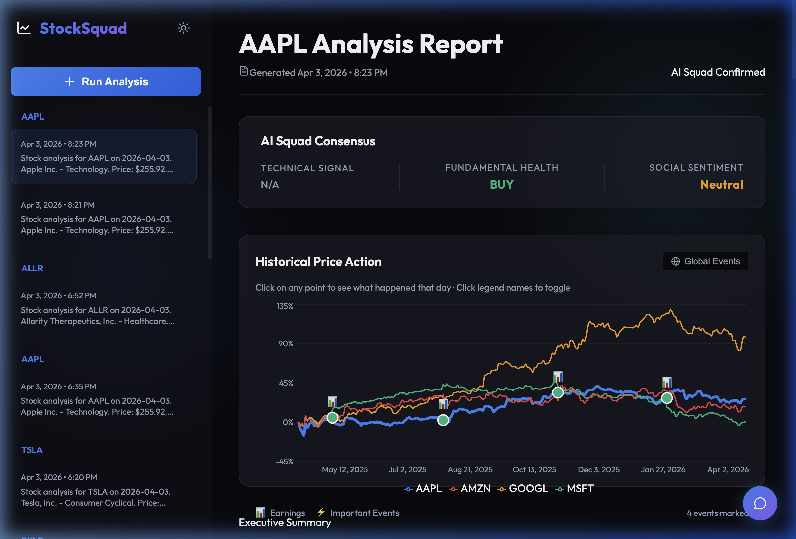
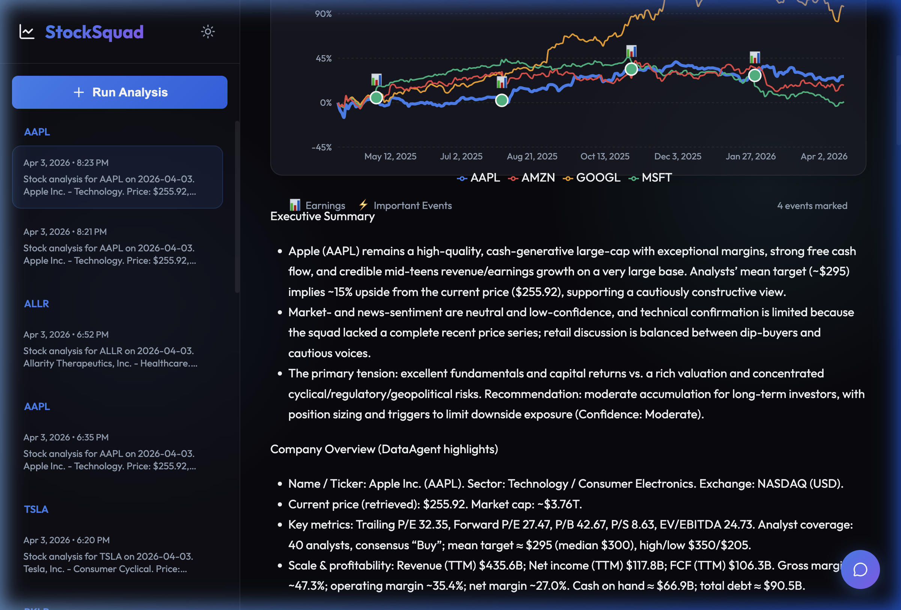
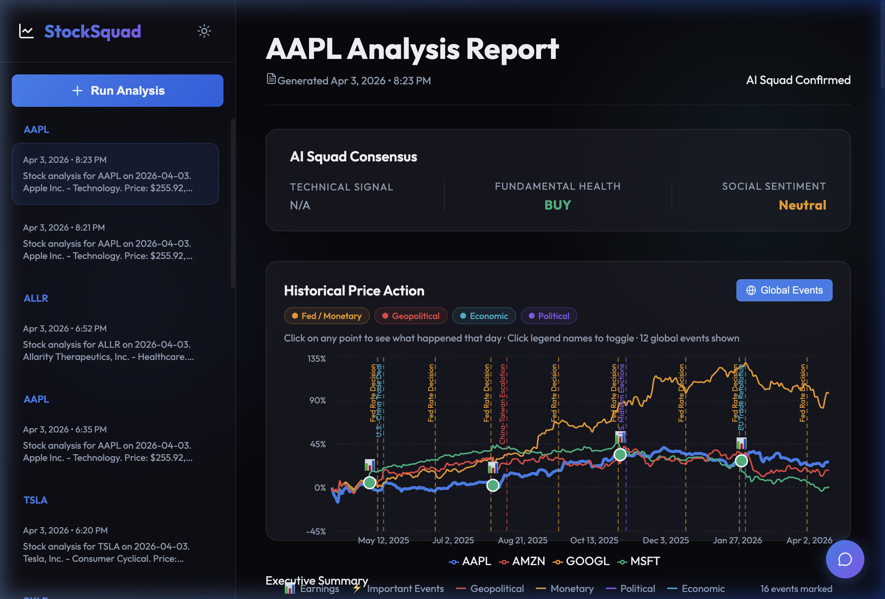
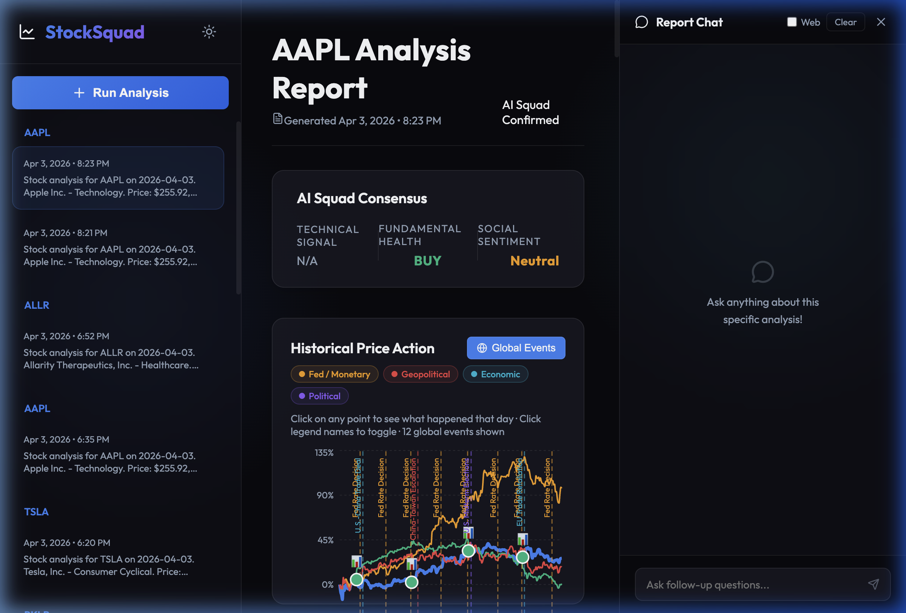
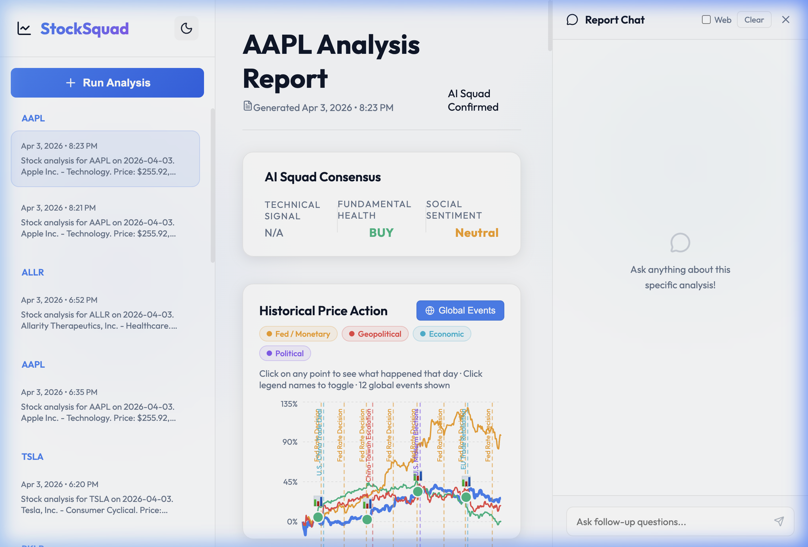

# StockSquad


> A multi-agent AI system for comprehensive stock research — powered by Azure AI Foundry, ChromaDB, and an ensemble of trained ML models.

StockSquad coordinates a squad of specialized AI agents that each own a distinct analytical role: data collection, technical analysis, sentiment scoring, fundamental research, and adversarial debate. Together they produce structured investment research reports for any ticker.

<p align="center">
  
</p>

## Features

- **7 Specialized Agents** — Orchestrator, Data, Technical, Sentiment, Social Media, Fundamentals, Devil's Advocate
- **Dual Memory System** — Short-term session scratchpad + long-term ChromaDB vector store with semantic search
- **ML Signal Scoring** — Ensemble of XGBoost, Random Forest, and LightGBM models with walk-forward validation
- **Backtesting Engine** — Evaluate model performance on historical data with transaction cost modeling
- **Telegram Bot** — Trigger full analyses via `/analyze AAPL` from any device
- **Web Dashboard** — Interactive React dashboard with peer comparison charts, global event overlays, and AI chat
- **Rich CLI** — Beautiful terminal output with progress indicators via [Rich](https://github.com/Textualize/rich)
- **Azure ML Integration** — Distributed model training on managed compute clusters

## Architecture

```
┌─────────────────────────────────────────────────────────────────┐
│                      OrchestratorAgent                          │
│         (Coordinates workflow & synthesizes reports)            │
└──────────────────────────┬──────────────────────────────────────┘
                           │
                 ┌─────────┴─────────┐
                 │                   │
        ┌────────▼────────┐   ┌─────▼──────────┐
        │   DataAgent     │   │ TechnicalAgent │
        │ (Market data)   │   │ (TA + ML model)│
        └─────────────────┘   └────────────────┘
                 │                   │
        ┌────────▼────────┐   ┌─────▼──────────┐
        │ SentimentAgent  │   │ SocialAgent    │
        │ (News analysis) │   │ (Social media) │
        └─────────────────┘   └────────────────┘
                 │                   │
        ┌────────▼────────┐   ┌─────▼──────────┐
        │ FundamentalsAg. │   │ DevilsAdvocate │
        │ (Financials)    │   │ (Challenges)   │
        └─────────────────┘   └────────────────┘
                 │
        ┌────────┴────────┐
        │                 │
   ┌────▼─────────┐  ┌───▼────────────┐
   │ Short-term   │  │  Long-term     │
   │ Memory       │  │  Memory        │
   │ (Session)    │  │  (ChromaDB)    │
   └──────────────┘  └────────────────┘

┌─────────────────────────────────────────────────────────────────┐
│                      ML Pipeline (Phase 4)                      │
├─────────────────────────────────────────────────────────────────┤
│                                                                 │
│  Data Collection → Feature Engineering → Model Training        │
│     (yfinance)         (Indicators)         (XGBoost/RF)       │
│                                                  │              │
│                                                  ↓              │
│                                          Prediction Engine      │
│                                                  │              │
│                                                  ↓              │
│                                          TechnicalAgent         │
│                                                                 │
└─────────────────────────────────────────────────────────────────┘
```

## Prerequisites

- Python 3.11+
- An Azure subscription with:
  - Azure OpenAI Service (GPT-4o deployment)
  - Azure OpenAI embeddings deployment (`text-embedding-ada-002`)
- Azure CLI installed and authenticated
- **macOS only:** OpenMP runtime for XGBoost (see step 2 below)

## Installation

### 1. Clone and set up the environment

```bash
git clone https://github.com/ellacarmon/StockSquad.git
cd StockSquad

python3 -m venv venv
source venv/bin/activate  # Windows: venv\Scripts\activate

pip install -r requirements.txt
```

### 2. macOS only — install OpenMP for XGBoost

```bash
brew install libomp
# verify:
python3 -c "import xgboost; print('✅ XGBoost ready')"
```

See `ml/README.md` for troubleshooting. Linux/Windows users can skip this.

### 3. Configure environment variables

```bash
cp .env.example .env
```

Edit `.env`:

```env
AZURE_OPENAI_ENDPOINT=https://<your-resource>.openai.azure.com/
AZURE_OPENAI_API_KEY=<your-api-key>
AZURE_OPENAI_DEPLOYMENT_NAME=gpt-4o
AZURE_OPENAI_EMBEDDING_DEPLOYMENT_NAME=text-embedding-ada-002
AZURE_OPENAI_API_VERSION=2024-02-15-preview
CHROMA_DB_PATH=./chroma_db
LOG_LEVEL=INFO
```

### 4. Authenticate with Azure

```bash
az login
```

StockSquad uses `DefaultAzureCredential`, so your Azure CLI session is picked up automatically.

## Usage

### Analyze a stock (CLI)

```bash
python main.py analyze AAPL

# With options
python main.py analyze NVDA --period 6mo
python main.py analyze MSFT --save
python main.py analyze TSLA --show-data
```

### Telegram bot

```bash
python3 telegram_bot/bot.py
```

Then send `/analyze AAPL` in Telegram. The bot coordinates all 7 agents and returns a full report.

### View history and system info

```bash
python main.py history AAPL          # past analyses
python main.py history AAPL --limit 3
python main.py stats                 # memory statistics
python main.py config                # current configuration
```

### ML pipeline

```bash
# Run the full pipeline test
python3 ml/test_ml_pipeline.py

# Collect training data (S&P 100, 5 years)
python3 ml/training/prepare_training_data.py --universe sp100 --period 5y

# Train models
python3 ml/training/train_models.py

# Test predictions
python3 ml/inference/prediction_engine.py

# (Optional) Train on Azure ML
python3 ml/azure_ml/train_on_azure.py \
    --subscription-id <id> \
    --resource-group <rg> \
    --workspace <workspace>
```

### Backtesting

```bash
# Single model
PYTHONPATH=. python3 ml/backtesting/run_backtest.py \
    --ticker AAPL --start 2024-01-01 --end 2024-12-31 \
    --model xgboost --holding-days 5 --confidence 60

# Ensemble (recommended — highest win rate)
PYTHONPATH=. python3 ml/backtesting/run_backtest.py \
    --ticker AAPL --model ensemble_unanimous --confidence 60

# Export results
PYTHONPATH=. python3 ml/backtesting/run_backtest.py \
    --ticker NVDA --model ensemble_unanimous \
    --export results.json --export-trades trades.csv
```

**Backtest results on AAPL 2024:**

| Strategy | Win Rate | Accuracy | Profit Factor |
|---|---|---|---|
| Ensemble Unanimous | **61.9%** | **69.8%** | **1.92** |
| XGBoost | 54.5% | 60.3% | 1.41 |
| Random Forest | 49.3% | 70.4% | 1.25 |

> Transaction costs (0.2% round-trip) are included in all results.

## Web Dashboard

StockSquad includes a full-featured web dashboard built with React + Vite for interactive analysis.

```bash
# Start the backend
uvicorn ui.api:app --host 127.0.0.1 --port 8000

# Start the frontend (in a separate terminal)
cd ui/web && npm run dev
```

### Dashboard Features

<table>
<tr>
<td width="50%">

**📊 Analysis Reports**
Interactive peer comparison charts, AI Squad Consensus with signal pills, and rendered markdown reports.



</td>
<td width="50%">

**🌍 Global Events Overlay**
Toggle macro events (Fed decisions, geopolitical, economic, political) directly on the price chart with per-category filters.



</td>
</tr>
<tr>
<td width="50%">

**💬 Report Chat**
Ask follow-up questions about any analysis with optional web search. Slides in from the right.



</td>
<td width="50%">

**🌙 Dark & Light Themes**
Full theme support with smooth transitions.



</td>
</tr>
</table>

## Project Structure

```
StockSquad/
├── agents/
│   ├── __init__.py
│   ├── orchestrator.py        # Workflow orchestration
│   ├── data_agent.py          # Market data collection
│   ├── technical_agent.py     # Technical analysis + ML
│   ├── sentiment_agent.py     # News sentiment analysis
│   ├── social_media_agent.py  # Social media sentiment
│   ├── fundamentals_agent.py  # Financial analysis
│   ├── devils_advocate.py     # Challenge analysis
│   ├── assistant_utils.py     # Intelligent run monitoring
│   └── run_diagnostics.py     # Debugging tools
├── memory/
│   ├── __init__.py
│   ├── short_term.py          # Session memory
│   └── long_term.py           # ChromaDB vector store
├── tools/
│   ├── __init__.py
│   ├── market_data.py         # yfinance wrapper
│   ├── ta_indicators.py       # Technical indicators
│   └── news_api.py            # News fetching
├── ml/
│   ├── signal_model.py        # ML + rule-based signal scorer
│   ├── training/
│   │   ├── data_collector.py  # Historical data collection
│   │   ├── feature_engineer.py# Feature engineering
│   │   ├── train_models.py    # Model training
│   │   └── prepare_training_data.py
│   ├── inference/
│   │   ├── prediction_engine.py  # Real-time predictions
│   │   └── ensemble_predictor.py # Ensemble model voting
│   ├── backtesting/
│   │   ├── simple_backtester.py  # Walk-forward backtesting
│   │   ├── metrics.py         # Performance metrics
│   │   ├── report.py          # Results reporting
│   │   └── run_backtest.py    # CLI interface
│   ├── azure_ml/
│   │   ├── train_on_azure.py  # Azure ML job submission
│   │   └── conda_env.yml      # Azure ML environment
│   ├── models/                # Trained models (.joblib)
│   ├── test_ml_pipeline.py    # ML pipeline tests
│   └── README.md              # ML documentation
├── telegram_bot/
│   ├── bot.py                 # Telegram bot implementation
│   └── README.md              # Bot setup instructions
├── data/                      # Data storage directory
├── chroma_db/                 # ChromaDB storage
├── reports/                   # Saved reports
├── main.py                    # CLI entry point
├── config.py                  # Configuration management
├── requirements.txt           # Python dependencies
├── .env.example              # Environment template
└── README.md                 # This file
```

## How It Works

1. A ticker is submitted via CLI or Telegram bot
2. **OrchestratorAgent** checks long-term memory for prior analyses of the same stock
3. Each specialist agent runs in parallel — collecting data, computing signals, scoring sentiment, analyzing fundamentals, and challenging assumptions
4. The Orchestrator synthesizes all findings into a structured report
5. The report is stored in ChromaDB with vector embeddings, making it retrievable in future runs

## Example Output

```
╭─────────────────────────────────────────╮
│      StockSquad Analysis                │
│ Ticker: AAPL | Period: 1y              │
╰─────────────────────────────────────────╯

[OrchestratorAgent] Analyzing AAPL...
[OrchestratorAgent] Checking for past analyses...
[OrchestratorAgent] Found 2 past analysis(es)
[OrchestratorAgent] Requesting data collection from DataAgent...
[OrchestratorAgent] Data collection complete
[OrchestratorAgent] Synthesizing final report...
[OrchestratorAgent] Report synthesis complete
[OrchestratorAgent] Storing analysis in long-term memory...

Analysis complete!

================================================================================

# Executive Summary

Apple Inc. (AAPL) demonstrates strong financial health with...

[Full report continues...]

================================================================================
```

## Memory System

### Short-Term Memory
- In-memory storage for current analysis session
- Shared scratchpad where agents post intermediate findings
- Message history for agent communication
- Cleared after each analysis

### Long-Term Memory
- Persistent storage using ChromaDB
- Vector embeddings for semantic search
- Indexed by ticker and date
- Agents reference past analyses in new reports

## Troubleshooting

**`Failed to load configuration`**
Ensure `.env` exists and contains a valid `AZURE_OPENAI_ENDPOINT` and `AZURE_OPENAI_API_KEY`.

**`DefaultAzureCredential failed to retrieve a token`**
Run `az login` and verify your account has access to the Azure OpenAI resource.

**`ModuleNotFoundError`**
Ensure the virtual environment is active and dependencies are installed:
```bash
source venv/bin/activate
pip install -r requirements.txt
```

## Roadmap

- [x] Foundation — DataAgent, OrchestratorAgent, short + long-term memory, CLI
- [x] Full agent squad — Technical, Sentiment, Social Media, Fundamentals, Devil's Advocate
- [x] Telegram bot interface
- [x] ML pipeline — training, inference, backtesting, ensemble predictor, Azure ML
- [x] Web dashboard — React UI with interactive charts, global events, and AI chat
- [ ] Alternative data — options flow, insider trading signals
- [ ] Advanced agents — OptionsAgent, MacroAgent, InsiderAgent
- [ ] Azure AI Foundry Evaluation integration
- [ ] Automated model retraining pipeline
- [ ] API endpoint deployment + multi-user support

## Contributing

Contributions are welcome. Please open an issue to discuss proposed changes before submitting a pull request.

## Resources

- [Azure AI Foundry Docs](https://learn.microsoft.com/en-us/azure/ai-foundry/)
- [Azure OpenAI Service](https://learn.microsoft.com/en-us/azure/ai-services/openai/)
- [ChromaDB Documentation](https://docs.trychroma.com/)
- [yfinance](https://github.com/ranaroussi/yfinance)

## License

MIT — see [LICENSE](LICENSE) for details.

---

> ⚠️ **Disclaimer:** StockSquad is for educational and research purposes only. Nothing in this project constitutes financial advice. Stock trading involves substantial risk. Always consult a qualified financial advisor before making investment decisions.

**Stack:** Python 3.11+ · Azure AI Foundry · Azure OpenAI · ChromaDB · XGBoost · LightGBM
